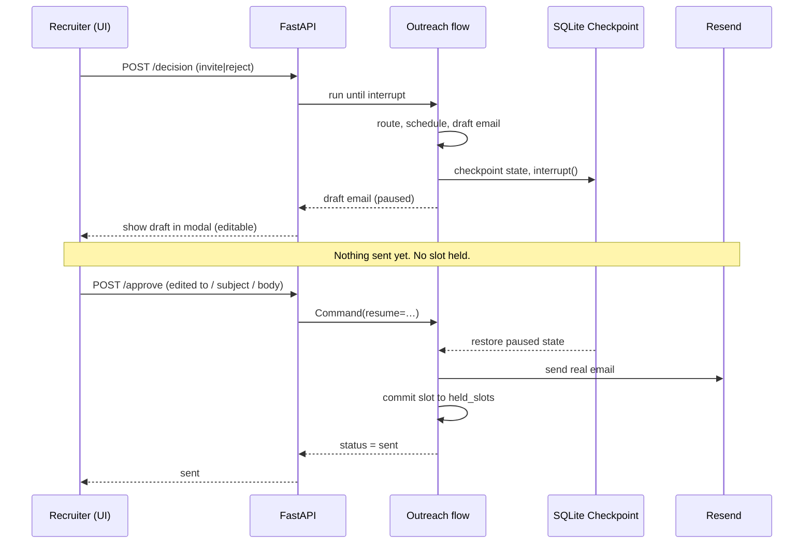

# Panel: AI Recruiting & Candidate Screening Pipeline

A multi-agent AI product, built with **LangGraph**, that turns a job description and a stack of résumés into an evidence-grounded, ranked shortlist, then drafts interview-invite or rejection emails **behind a human approval gate** before anything is sent.

It is not a chatbot. It is a structured pipeline of specialized reasoning agents and deterministic nodes, orchestrated with LangGraph, with a FastAPI backend and a React recruiter console.

---

## Table of contents
- [The problem](#the-problem)
- [Who it is for](#who-it-is-for)
- [Why it matters](#why-it-matters)
- [What it does](#what-it-does)
- [Why a multi-agent system](#why-a-multi-agent-system)
- [Architecture](#architecture)
- [Pipeline phases](#pipeline-phases)
- [Human-in-the-loop approval flow](#human-in-the-loop-approval-flow)
- [Tech stack](#tech-stack)
- [Repository layout](#repository-layout)
- [Setup](#setup)
- [Running the app](#running-the-app)
- [End-to-end usage](#end-to-end-usage)
- [API reference](#api-reference)
- [Testing](#testing)
- [Guardrails & responsible AI](#guardrails--responsible-ai)
- [Design decisions](#design-decisions)
- [Limitations](#limitations)

---

## The problem

Recruiting at scale is broken. For a single opening a team can receive hundreds of résumés. Screening them by hand takes days, the "rubric" lives in each reviewer's head and is applied inconsistently, and the resulting decisions are subjective and hard to explain or audit later. Two reviewers rank the same candidate differently, and the same reviewer drifts between the first résumé and the hundredth. There is rarely a defensible, written record of why a candidate was advanced or rejected.

## Who it is for

An in-house recruiter or hiring manager screening a pool of candidates against one open role. The product assumes a human stays in charge: it does the reading, scoring, and drafting, while the recruiter makes every consequential decision and approves every message before it leaves the system.

## Why it matters

- **Time:** turns days of manual reading into a single automated pass plus a human review.
- **Consistency:** every candidate is scored against the same retrieved rubric and the same criteria, instead of a reviewer's shifting mental bar.
- **Auditability:** every score cites specific evidence from the résumé, and every ranking carries written reasoning, so a decision can be explained and defended later.
- **Safety:** nothing consequential, an email to a real candidate or a calendar commitment, happens without explicit human approval.

---

## What it does

1. **Parses** a job description into a structured role (title, family, seniority, required/preferred skills).
2. **Retrieves** a role-specific competency rubric from a vector database (**RAG**) so scoring is grounded in agreed criteria rather than model opinion.
3. **Screens** every candidate in parallel: an LLM agent scores each competency from 1 to 10 with cited evidence.
4. **Ranks** the whole pool comparatively into a shortlist with reasoning, recommendation, strengths, and concerns.
5. Lets a recruiter **Invite** or **Reject** each candidate; a second graph **schedules** an interview, **drafts** a personalized email, and **pauses for human approval** before it **sends the email for real** and commits the interview slot.

---

## Why a multi-agent system

Each step is a fundamentally different kind of reasoning, and a single prompt trying to do all of them would give unfocused output, no auditability, and impossible debugging.

- **Parsing a JD** is structured extraction.
- **Scoring one candidate** is independent judgment against a rubric: the "map", each résumé scored in isolation, in parallel.
- **Ranking a pool** is comparative judgment across candidates: the "reduce", one pass over all the scorecards.
- **Scheduling** is deterministic slot maths.
- **Drafting outreach** is controlled generation.

Splitting these into specialized components, **three reasoning agents (Screening, Ranking, Outreach) plus deterministic nodes for the mechanical work (parsing, retrieval, scheduling)**, gives each a single clear responsibility, a typed handoff, and an isolated trace you can debug. Using an LLM only where judgment is actually required, and a deterministic node everywhere else, is a core design principle of the system.

This architecture also answers a common concern directly: **we never feed hundreds of résumés into one call.** Screening fans out so that each LLM call sees exactly one résumé plus the JD and the retrieved rubric. That keeps every context window small and focused and avoids the attention-dilution and hallucination you get from stuffing a giant context. The only step that reasons across the whole pool, Ranking, compares compact structured scorecards rather than re-reading every full résumé.

---

## Pipeline phases

| | Ranking phase | Outreach phase |
|---|---|---|
| **Trigger** | `POST /api/rank` | `POST /api/candidates/{id}/decision` |
| **Nature** | Automated, runs end-to-end | Human-driven, **branches** and **pauses** |
| **Steps** | parse JD, retrieve rubric (RAG), screen (parallel), rank | route on decision, schedule, draft, **approve**, send |
| **Key features** | parallel fan-out (`Send`), structured outputs | conditional branching, **human-in-the-loop** (`interrupt`), durable checkpoints |

Keeping scoring and outreach as separate phases keeps each one simple and independently testable: one is a straight-through scoring pipeline; the other branches per candidate and stops for a human.

---

## Human-in-the-loop approval flow

High-impact actions (sending a real email, committing a calendar slot) never happen without explicit human approval. This is implemented with LangGraph's `interrupt()` and a `SqliteSaver` checkpointer.



---

## Tech stack

| Layer | Technology |
|---|---|
| Orchestration | **LangGraph** (state graphs, conditional edges, `Send`, `interrupt`, `SqliteSaver`) |
| LLM | **OpenAI** `gpt-4o` (chat) and `text-embedding-3-small` (embeddings), via LangChain |
| Vector DB / RAG | **Pinecone** (serverless, cosine) |
| Email delivery | **Resend** API (real outbound email) |
| Calendar | Mock service (`availability.json`) |
| Backend | **FastAPI** + Uvicorn, **Pydantic** contracts |
| Frontend | **React** + **Vite** |
| Observability | **LangSmith** tracing |
| Tests | **pytest** (in-process FastAPI `TestClient`) |

---

## Repository layout

```
Panel/
├── start.sh                       # launch backend + frontend together
├── architechture.md               # mermaid architecture diagram
├── backend/
│   ├── start.sh                   # venv + deps + uvicorn
│   ├── requirements.txt
│   ├── scripts/ingest_rubrics.py  # one-time: rubrics.json into Pinecone
│   ├── data/
│   │   ├── rubrics.json           # 24 competency rubric chunks
│   │   ├── availability.json      # interviewer free windows (mock calendar)
│   │   ├── job_descriptions/      # sample JDs
│   │   └── resumes/               # sample résumé PDFs
│   ├── tests/test_cases.py        # 8 evaluation scenarios
│   └── app/
│       ├── main.py                # FastAPI endpoints
│       ├── config.py              # settings / env
│       ├── llm.py, vectordb.py    # OpenAI + Pinecone helpers
│       ├── schemas.py, state.py   # Pydantic contracts + shared graph state
│       ├── graphs/
│       │   ├── ranking_graph.py   # ranking phase
│       │   └── outreach_graph.py  # outreach phase (HITL)
│       ├── nodes/                 # jd_parser, rubric_retriever, resume_parser,
│       │                          # screening_agent, ranking_agent,
│       │                          # scheduler_agent, outreach_agent
│       └── services/              # calendar_mock, email_mock (Resend), store
└── frontend/
    └── src/                       # App.jsx, api.js, components/
```

---

## Setup

### Prerequisites
- Python 3.12+, Node 18+ / npm
- API keys: **OpenAI**, **Pinecone**, **Resend** (LangSmith optional)

### 1. Environment variables
Create `backend/.env` (copy from `backend/.env.example`):

```bash
OPENAI_API_KEY=sk-...
OPENAI_CHAT_MODEL=gpt-4o
OPENAI_EMBED_MODEL=text-embedding-3-small

PINECONE_API_KEY=...
PINECONE_INDEX_NAME=recruiting-rubrics
PINECONE_NAMESPACE=rubrics
PINECONE_CLOUD=aws
PINECONE_REGION=us-east-1

RESEND_API_KEY=re_...
RESEND_FROM_EMAIL="Recruiting <you@your-verified-domain>"

LANGSMITH_TRACING=true
LANGSMITH_API_KEY=lsv2_...
LANGSMITH_PROJECT=recruiting-pipeline

API_CORS_ORIGINS=http://localhost:5173,http://127.0.0.1:5173
```

> **Note:** `backend/.env` must live in `backend/` (the backend loads it from there), not the repository root.

### 2. Seed the rubric vector store (one time)
This creates the Pinecone index and uploads the 24 rubric chunks:

```bash
cd backend
python3 -m venv .venv && .venv/bin/pip install -r requirements.txt
.venv/bin/python scripts/ingest_rubrics.py
# Output: "Ingested 24 rubric chunks into Pinecone."
```

---

## Running the app

From the repository root:

```bash
./start.sh
```

This launches both servers (and installs dependencies on first run):
- **Backend:** http://localhost:8000 (health: `/health`, docs: `/docs`)
- **Frontend:** http://localhost:5173

Stop with `Ctrl-C`.

---

## End-to-end usage

1. **Upload résumés** (PDF). Candidates receive ids `c001, c002, …`.
2. **Pick a JD** and click **Create Ranking**. Scorecards and the ranked shortlist appear.
3. Click **Invite** or **Reject** on a candidate. A draft email opens in a modal; the workflow has paused at the approval gate, so nothing is sent yet.
4. Edit the recipient, subject, or body if needed, then **Approve and Send**. The email is sent via Resend and the interview slot is held.

> **Warning:** Approving an **invite** sends a **real email** via Resend. The parsed sample addresses (`*@example.test`) are not deliverable, so set a real recipient in the modal before approving.

---

## API reference

| Method | Path | Purpose |
|---|---|---|
| `GET` | `/health` | Liveness check |
| `GET` | `/api/state` | Full current session (for the UI) |
| `GET` | `/api/candidates` | List the résumé pool |
| `POST` | `/api/candidates/upload` | Upload résumé PDFs |
| `DELETE` | `/api/candidates` | Clear the pool |
| `DELETE` | `/api/candidates/{id}` | Remove one candidate |
| `POST` | `/api/rank` | Run the ranking phase (parse, retrieve, screen, rank) |
| `POST` | `/api/candidates/{id}/decision` | Run the outreach phase to the approval gate; returns the draft |
| `POST` | `/api/candidates/{id}/approve` | Resume the outreach phase; send the email; commit the slot |
| `POST` | `/api/rubrics/query` | Debug: raw rubric retrieval |
| `POST` | `/api/debug/parse-jd`, `/parse-resume-text`, `/parse-resume-file` | Debug parsers |

---

## Testing

Eight evaluation scenarios in `backend/tests/test_cases.py`, split into two tiers:
- **Deterministic** scenarios run with **no API keys** (parsing, scheduling, the outreach flow with template fallback, the approval gate, pool/reset semantics).
- **Full-pipeline** scenarios (strong match, mismatch, retrieval correctness, ranking determinism) require `OPENAI_API_KEY` and `PINECONE_API_KEY`, and are skipped automatically when keys are absent.

The suite wipes all local state between tests and **monkeypatches the email send**, so tests never deliver real email.

```bash
cd backend
.venv/bin/python -m pytest tests -v
```

---

## Guardrails & responsible AI

- **Human-in-the-loop approval gate:** the model can *draft*, but it cannot *act*. Sending an email and committing a slot sit strictly behind explicit human approval (`interrupt()` plus checkpointer).
- **Hard send guard:** `send_email` refuses to run unless the draft is `approved`.
- **Recipient validation:** the outgoing address is validated before any real send.
- **Fairness:** the screening prompt forbids protected-class/demographic factors and requires evidence-cited, job-relevant scores.
- **Schema validation:** all agent handoffs are validated Pydantic models (for example, scores constrained to 1 to 10); the ranking output is cross-checked to cover the pool exactly.
- **Graceful degradation:** résumé parsing falls back to regex, and email drafting falls back to a clean template, if the LLM is unavailable.
- **No-availability branch:** if no interview slots are free, the workflow returns control to the recruiter instead of sending an empty invite.

---

## Design decisions

- **Separate scoring and outreach phases:** automated scoring versus human-gated, branching outreach. Each stays simple and independently testable.
- **Agents only where judgement is needed:** Screening, Ranking, and Outreach use the LLM; JD parsing, rubric retrieval, and scheduling are deterministic.
- **RAG only where it helps:** rubrics are retrieved to ground scoring; nothing else uses retrieval.
- **Scheduling is deterministic:** finding open slots is set subtraction (free windows minus held slots), not a model call.
- **Calendar mocked, email real:** slot maths needs no external service; email is delivered for real via Resend *after* approval, which is exactly why the approval gate is the core guardrail.

---

## Limitations

- **Per-pool ranking has a context ceiling.** Screening is bounded to one résumé per call and scales freely, but the Ranking step compares all scorecards in a single pass. For a very large pool that pass would eventually exceed the context window and would need batched ranking (rank in groups, then rank the group winners). Screening, the part most exposed to hallucination, never has this problem by design.
- **JD parsing is regex-based.** It keys off common section headers and seniority keywords, so an unusually formatted JD produces a weaker retrieval query. This is mitigated because retrieval is semantic (a rough query still lands near the right rubric chunks) and because the recruiter can paste raw JD text directly; replacing the regex with a small structured-output LLM parser is the natural upgrade.
- **Slots are committed at send time, not offer time.** This leaves a small double-booking window if candidates are processed far out of order.
- **The pipeline ends at "sent".** It does not process the candidate's reply or finalize a single booked slot (a deliberate scope cut).
- **Single active session.** The session store has no multi-user support or auth, a demo simplification.
- **Prompt-injection defense is architectural.** It relies on least-privilege plus the human approval gate rather than a dedicated input classifier; adding one (for example a Guardrails-AI or Prompt-Guard validator) is the natural next step.