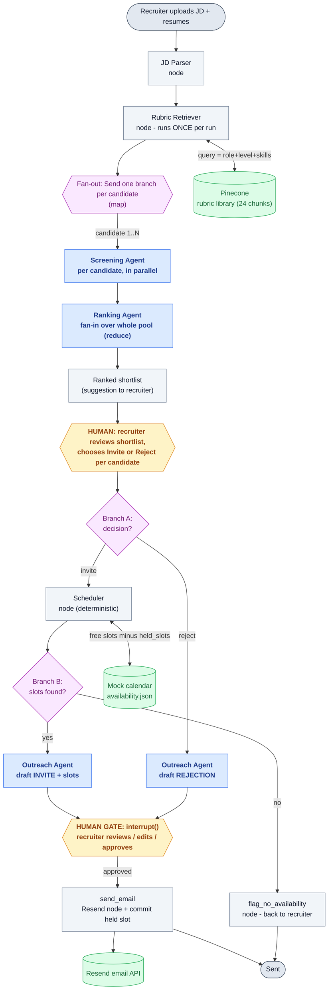

# End-to-end overview

```mermaid
flowchart TD
    START([Recruiter uploads JD + resumes]):::se

      direction TB
      JD["JD Parser<br/>node"]:::node
      RET["Rubric Retriever<br/>node - runs ONCE per run"]:::node
      FAN{{"Fan-out: Send one branch per candidate<br/>(map)"}}:::branch
      SCR["Screening Agent<br/>per candidate, in parallel"]:::agent
      RANK["Ranking Agent<br/>fan-in over whole pool (reduce)"]:::agent
      JD --> RET --> FAN
      FAN -->|candidate 1..N| SCR
      SCR --> RANK


    PINE[("Pinecone<br/>rubric library (24 chunks)")]:::ext
    RET <-->|"query = role+level+skills"| PINE

    START --> JD
    RANK --> SHORT["Ranked shortlist<br/>(suggestion to recruiter)"]:::node
    SHORT --> HR{{"HUMAN: recruiter reviews shortlist,<br/>chooses Invite or Reject per candidate"}}:::human

    
      direction TB
      DR{"Branch A:<br/>decision?"}:::branch
      SCHED["Scheduler<br/>node (deterministic)"]:::node
      AVAIL{"Branch B:<br/>slots found?"}:::branch
      DI["Outreach Agent<br/>draft INVITE + slots"]:::agent
      DRJ["Outreach Agent<br/>draft REJECTION"]:::agent
      FLAG["flag_no_availability<br/>node - back to recruiter"]:::node
      GATE{{"HUMAN GATE: interrupt()<br/>recruiter reviews / edits / approves"}}:::human
      SEND["send_email<br/>Resend node + commit held slot"]:::node
      DR -->|invite| SCHED
      DR -->|reject| DRJ
      SCHED --> AVAIL
      AVAIL -->|yes| DI
      AVAIL -->|no| FLAG
      DI --> GATE
      DRJ --> GATE
      GATE -->|approved| SEND


    HR --> DR
    CAL[("Mock calendar<br/>availability.json")]:::ext
    MAIL[("Resend email API")]:::ext
    SCHED <-->|"free slots minus held_slots"| CAL
    SEND --> MAIL
    SEND --> DONE([Sent]):::se
    FLAG --> DONE

    classDef agent fill:#dbeafe,stroke:#2563eb,color:#1e3a8a,font-weight:bold;
    classDef node fill:#f1f5f9,stroke:#64748b,color:#0f172a;
    classDef human fill:#fef3c7,stroke:#d97706,color:#92400e,font-weight:bold;
    classDef branch fill:#fae8ff,stroke:#a21caf,color:#701a75;
    classDef ext fill:#dcfce7,stroke:#16a34a,color:#166534;
    classDef se fill:#e2e8f0,stroke:#334155,color:#0f172a;
```
